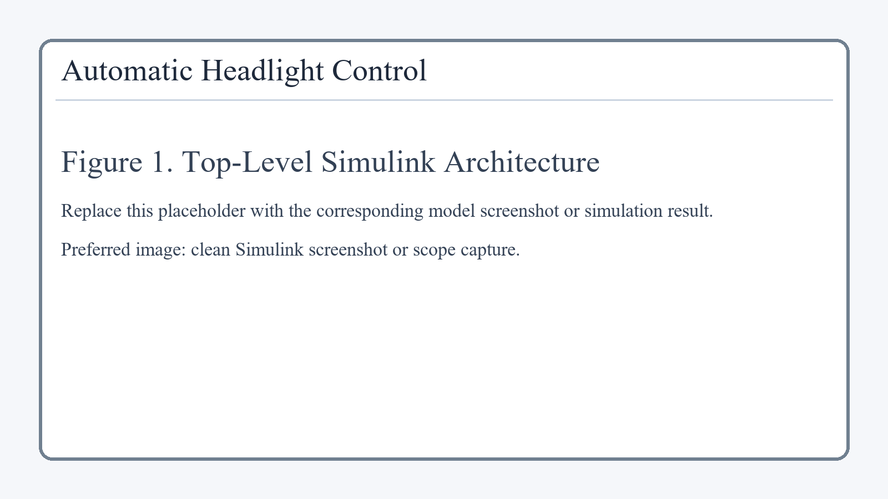
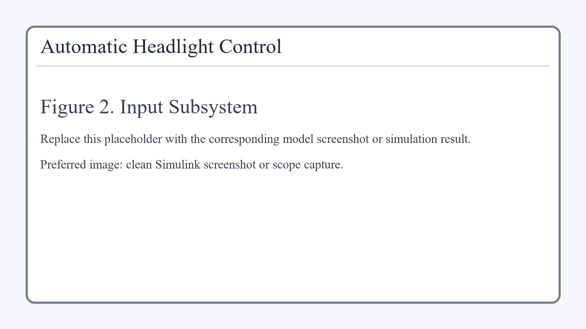
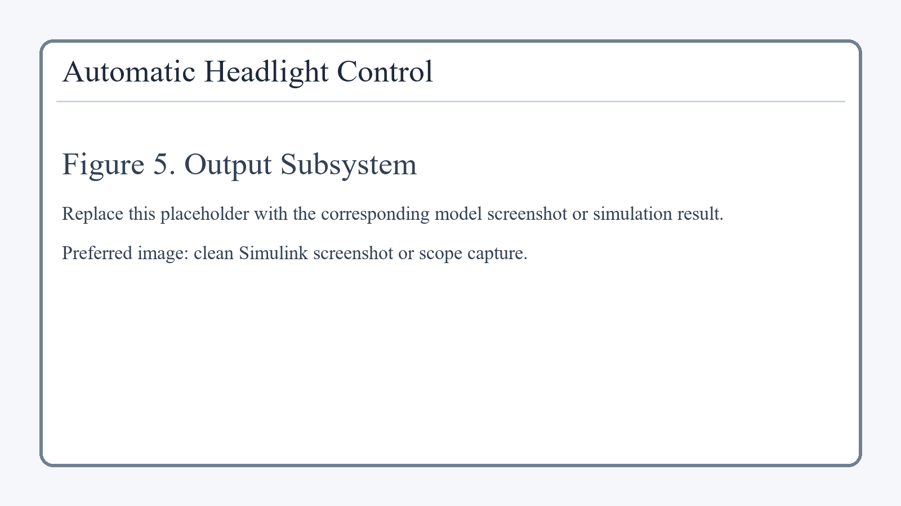
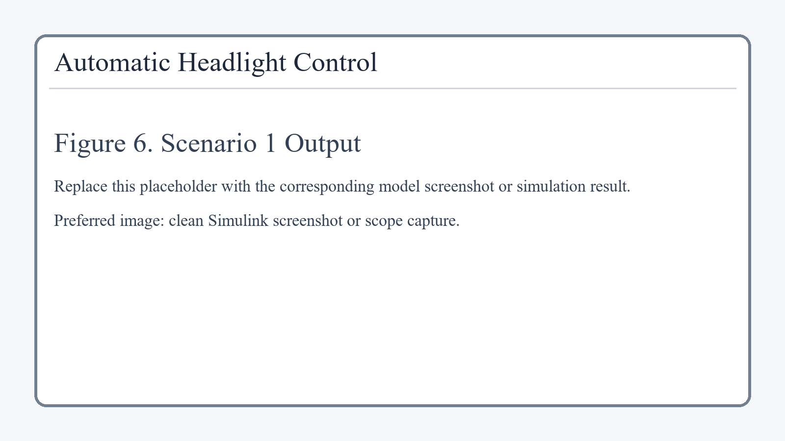
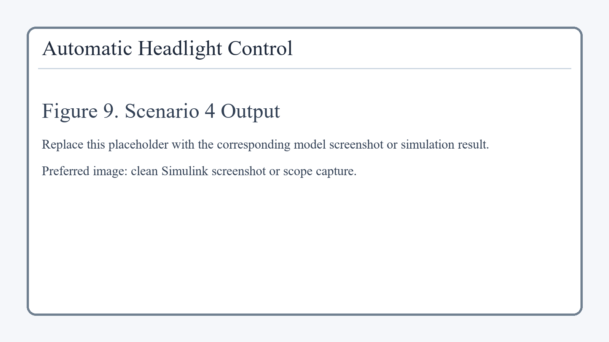

# Automatic Headlight Control System

An automotive **Automatic Headlight Control** model developed in **Simulink and Stateflow** as part of an experiential learning CA/project submission for **Electronics and Telecommunication Engineering (EnTC)**.

This project demonstrates how a vehicle can automatically switch headlights ON or OFF based on **ambient light intensity**, **vehicle speed**, and **driver manual override**, using a modular model-based design approach.

## Project Summary

The controller monitors:

- `AmbientLux` to detect whether the surroundings are bright or dark
- `VehicleSpeed` to detect whether the vehicle is moving or stopped
- `ManualOverride` to allow the driver to force the headlights ON
- `Fault` as a supervisory input carried through the design

The final output is:

- `headlamp_cmd`
  - `0` = headlights OFF
  - `1` = headlights ON

The complete model is organized into four major subsystems:

1. **Input Subsystem**
2. **Logic Subsystem**
3. **Stateflow Controller**
4. **Output Subsystem**

This separation makes the project easier to explain, test, verify, and demonstrate.

## Aim

To design and simulate an **Automatic Headlight Control System** using **Simulink and Stateflow** that automatically controls vehicle headlights based on environmental brightness and vehicle operating condition, while maintaining stable switching behavior using hysteresis and supporting manual override.

## Key Features

- Modular subsystem-based Simulink architecture
- State-based control using Stateflow
- Hysteresis logic to prevent flickering near the brightness threshold
- Manual override support
- Safety-oriented `HOLD` state for dark stopped conditions
- Multiple simulation scenarios for functional validation

## System Architecture

```text
Input Subsystem -> Logic Subsystem -> Stateflow Controller -> Output Subsystem
```

### Top-Level Model



## Subsystem Overview

### 1. Input Subsystem

The Input Subsystem generates all test inputs required by the model:

- `AmbientLux`
- `VehicleSpeed`
- `ManualOverride`
- `Fault`

It supports four simulation scenarios:

| Scenario | Description | AmbientLux | VehicleSpeed | Expected Output |
|---|---|---:|---:|---|
| 1 | Day + Moving | 800 lux | 60 | `0` |
| 2 | Night + Moving | 100 lux | 60 | `1` |
| 3 | Tunnel Entry | 800 -> 100 -> 800 lux | 60 | `0 -> 1 -> 0` |
| 4 | Night + Stopped | 100 lux | 0 | `1` |

The `ManualOverride` signal is controlled through a manual switch, and the `Fault` signal is currently kept at `0` in normal operation.



### 2. Logic Subsystem

The Logic Subsystem converts raw input values into stable boolean control signals for Stateflow.

It performs:

- `AmbientLux < 300` to detect dark condition
- `AmbientLux > 500` to detect bright condition
- `VehicleSpeed > 0` to detect moving condition

The lux logic uses **hysteresis**:

```text
lux_status = (previous_lux_status AND NOT lux_gt_500) OR lux_lt_300
```

This means:

- below `300 lux` -> dark condition becomes active
- above `500 lux` -> bright condition becomes active
- between `300` and `500 lux` -> previous decision is maintained

This prevents rapid ON/OFF flickering when light fluctuates near the threshold.


### 3. Stateflow Controller

The Stateflow chart is the supervisory decision-making unit of the project.

Inputs:

- `lux_status`
- `speed_status`
- `override`
- `fault`

Output:

- `headlamp_cmd`

The chart contains four states:

- **OFF**: bright condition, headlights OFF
- **ON**: dark and moving, headlights ON
- **HOLD**: dark and stopped, headlights ON
- **MANUAL**: override active, headlights ON

Transition priority:

1. If `override = 1`, enter `MANUAL`
2. Else if `lux_status = 0`, enter `OFF`
3. Else if `lux_status = 1` and `speed_status = 1`, enter `ON`
4. Else if `lux_status = 1` and `speed_status = 0`, enter `HOLD`

This structure makes the control logic clear, deterministic, and easy to validate.


### 4. Output Subsystem

The Output Subsystem is used to observe and verify the result of the controller.

It contains:

- `Headlamp_Display` for current logical output
- `Headlamp_Scope` for plotting output over time
- `Headlamp_ToWorkspace` for saving the signal as `out.headlamp_cmd_ts`



## Simulation Configuration

- **Simulation type:** Discrete-time
- **Fixed step size:** `0.1 s`
- **Stop time:** `40 s`

## Test Scenarios and Results

### Scenario 1: Day + Moving

- Bright environment
- Vehicle moving
- Controller remains in `OFF`
- Output: `headlamp_cmd = 0`



### Scenario 2: Night + Moving

- Dark environment
- Vehicle moving
- Controller enters `ON`
- Output: `headlamp_cmd = 1`


### Scenario 3: Tunnel Entry

- Starts in bright daylight
- Lux drops at approximately `10 s`
- Lux returns at approximately `20 s`
- Controller transitions `OFF -> ON -> OFF`
- Output: `0 -> 1 -> 0`


### Scenario 4: Night + Stopped

- Dark environment
- Vehicle stopped
- Controller enters `HOLD`
- Output: `headlamp_cmd = 1`



## Project Theory in Brief

The system senses brightness and motion, then processes those signals into logical conditions. Hysteresis is used to prevent unstable light switching around the threshold boundary. The processed signals are then passed to a Stateflow controller, which selects the correct operating state and produces the final headlamp command.

This reflects a practical automotive control design flow:

1. Sense conditions
2. Process raw signals
3. Apply supervisory state logic
4. Verify output behavior

## Deliverables Included

The repository includes the main model and the prepared submission package:

- `AutoHeadlightControl.slx`
- `submission_pack/deliverables/Automatic_Headlight_Control_Report.docx`
- `submission_pack/deliverables/Automatic_Headlight_Control_IEEE_Paper.docx`
- `submission_pack/deliverables/Automatic_Headlight_Control_Presentation.pptx`

## Repository Structure

```text
.
|-- AutoHeadlightControl.slx
|-- README.md
|-- PROJECT_SUMMARY.md
|-- submission_pack
|   |-- assets
|   |-- deliverables
|   |-- generate_presentation.mjs
|   `-- generate_submission_pack.py
`-- .gitignore
```

## How to Run

1. Open MATLAB.
2. Set the current folder to this project directory.
3. Open the model:

```matlab
open_system('AutoHeadlightControl')
```

4. Open the **Input Subsystem** and set the `Scenario` constant:
   - `1` = Day + Moving
   - `2` = Night + Moving
   - `3` = Tunnel Entry
   - `4` = Night + Stopped
5. Keep `ManualOverride = 0` for normal automatic operation.
6. Click **Run**.
7. Observe:
   - `Headlamp_Display`
   - `Headlamp_Scope`
   - `out.headlamp_cmd_ts`

## Educational Value

This project demonstrates:

- Model-based design using Simulink
- Supervisory logic using Stateflow
- Signal conditioning with hysteresis
- Scenario-based validation
- Automotive control system structuring

## Conclusion

This project successfully models an Automatic Headlight Control System using Simulink and Stateflow. It demonstrates correct headlight behavior for daylight, night driving, tunnel entry, and stopped-at-night conditions. The use of hysteresis improves stability, and the Stateflow controller provides a clean representation of the control logic using OFF, ON, HOLD, and MANUAL states.

## Author

**Palash Merwana**  
Electronics and Telecommunication Engineering (EnTC)
